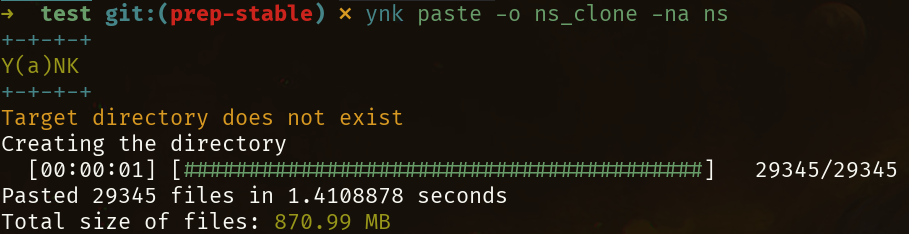

# Y(a)NK

Yank is the superior way to copy and paste files and large directories in the command line.

It allows you to have a workflow similar to copy and pasting muliple files and folders in GUI file managers in the terminal.
It does this by maintaining a persistant store that records file metadata when you add to it to create entries.
These entries can then be pasted at will using [queries](#queries), [ranges](#ranges) or just file names.

Moreover, ynk has the ability to exclude [hidden files](#hiddenfiles) and also respect the [.gitignore](#gitignore) file.
This combined with ynk's use of several parallel threads for the paste operation makes it ideal for pasting multiple large directories
together.

Not to mention ynk is *BLAZINGLY FAST*, like pasting 30,000 files in 1.4 seconds fast.



A video is worth a thousand pictures and about 10^6 words so, click on the screenshot above to watch the video for more details.

## Installing

Ynk is written in rust and is fully portable across Windows, MacOs and Linux.
However, ynk is only tested on Linux.
Moreover ynk comes prebuilt with libsqlite which is the database used for the store.

### Using Rust: Recommended

The minimium version of rust you would need for this is `v.1.71`.
Ynk is listed on cargo and you can install it on your system by the following command:

```bash
cargo install ynk --locked
```

This installs ynk prebuilt with libsqlite to the system.

### Using Git

You can also build ynk yourself on your machine.
To do this you can use the following commands:

```bash
git clone https://github.com/newtoallofthis123/ynk
cd ynk
cargo install --path .
```

This installs ynk using rust. 

### Binaries coming soon!

## Shell Completions

Ynk supports shell completions for bash, zsh, fish and powershell.
You can generate the respective completion files using the `ynk completions SHELL` command.
This can be them redirected to the `source` command.

```bash
ynk completions SHELL | source
```

Example for fish:

```bash
# In your fish config file
ynk completions fish | source
```

## Usuage

A shorter version of this can be viewed by using the `ynk --help` command and indivisual commands can be viewed by using `ynk help [COMMAND]`.

Primarily, ynk can be thought of as a clipboard that stores file metadata to later paste.

This means that unless you use either the `paste` or the `pop` option, no change whatsoever is made to the file system. Moreover, ynk does not ever modify the original file. It merely copies it.

The store files metadata in a format similar to below

| id  | name      | path                 | accessed_at         |
| --- | --------- | -------------------- | ------------------- |
| 1   | README.md | /home/user/README.md | 2020-01-01 00:00:00 |
| 2   | portfolio | /home/user/portfolio | 2020-03-01 00:00:00 |

A mini version of this is as below:

```bash
Copy paste files in the terminal

Usage: ynk [OPTIONS] [COMMAND]

Commands:
  list         List the entires in the store
  add          Add entries to the store
  delete       Delete entries from the ynk store
  pop          Pop the last entry in the ynk store
  clear        Clear all entries from the ynk store
  paste        Paste entries from the ynk store
  completions  Generate and write completions
  help         Print this message or the help of the given subcommand(s)

Options:
  -n, --noignore  Don't respect the .gitignore
  -y, --yes       Prompt yes to all prompts
  -a, --all       Also include hidden files in discovery
  -h, --help      Print help
  -V, --version   Print version
```

For more information on each command and their respective flag, refer [Usuage](Usuage.md)

## How it works

When you `add` an entry to ynk, it stores it's metadata, absolute path in `~/.ynk/store.db`.
This is a sqlite3 database that ynk then uses to query information from.
When you `paste` or `pop`, ynk merely reads the file metadata from the store and uses an optimized
directory walking algorithm to discover files and uses multiple `tokio` threads for the copy and pasting operation.
This makes ynk very fast. Moreover, it also shows you a clean progress bar while it is actually copy pasting the files and folders. 

> 29,000 files in about 1.5 seconds.

## License

Ynk is licensed under the [MIT LICENSE](LICENSE).
